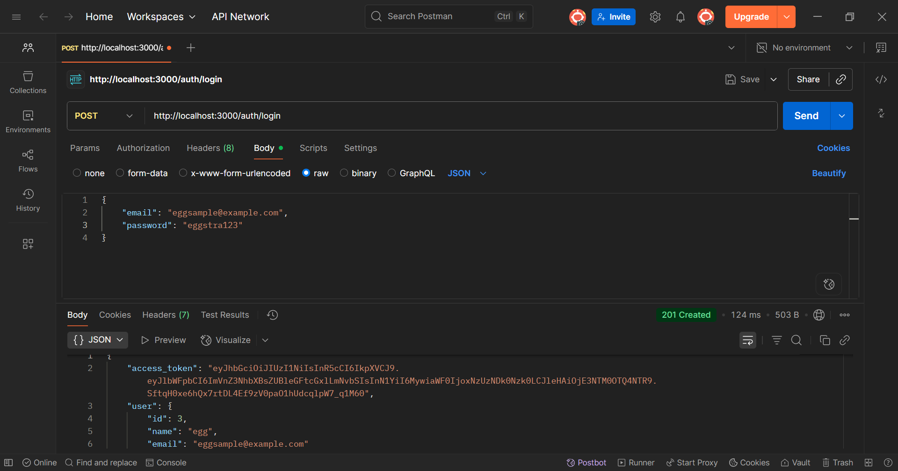
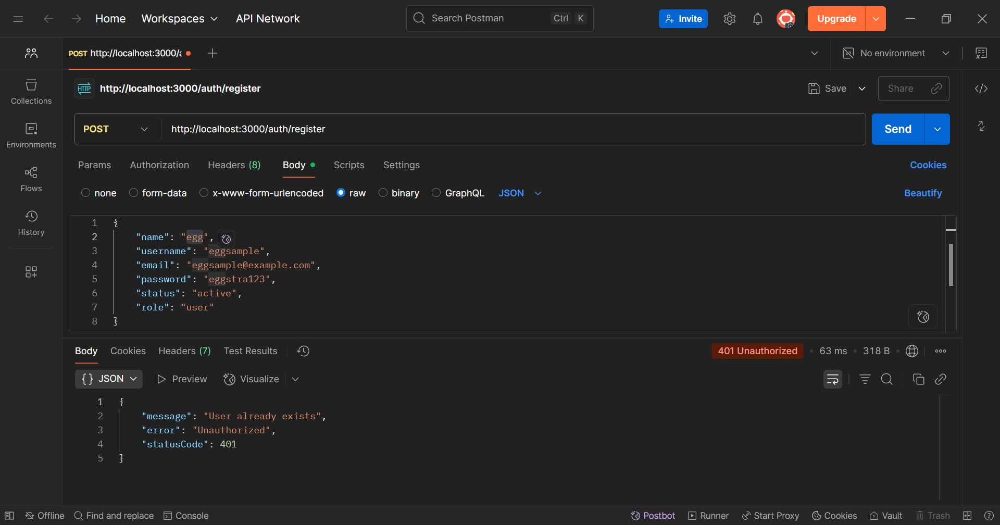
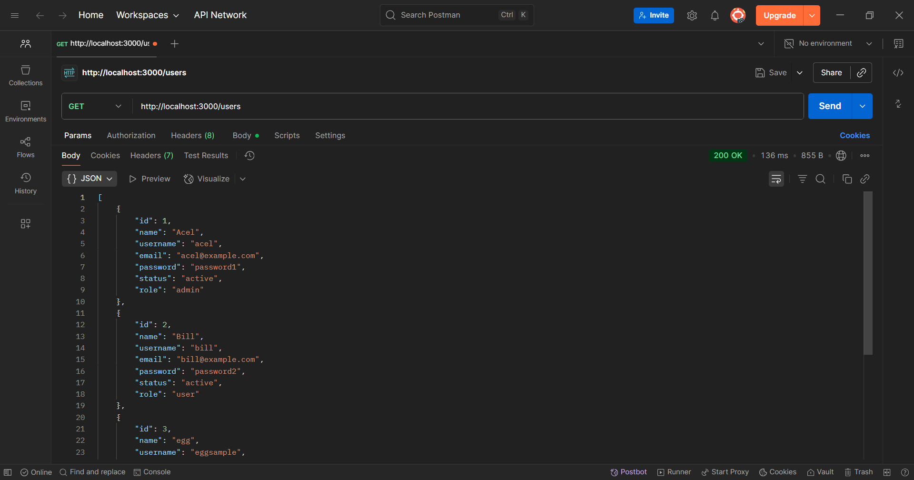

# Milestone 4 Project

## Overview

This is an overview of RevoBank backend. The features, tech stacks, and demo of this website is described down below.

## Features

* Security
- Bcrypt for password security

## Technologies Used

* Nest JS for building server-side applications
* DBeaver for database with postgreSQL

## How to use

1. Clone this repository below to your local repository

> https://github.com/revou-fsse-feb25/milestone-4-egaherawati10.git

2. Install the latest version of Nest Js in your terminal
> npm i -g @nestjs/cli

3. Install npm in your terminal if you haven't
> npm install

4. Run the project
> npm run start:dev

## Deployed Website :

> 

## Previews

Register User

User already registered

User Login

Get All Users

## Creator
Build with &#x2661; by Ega Herawati, 2025